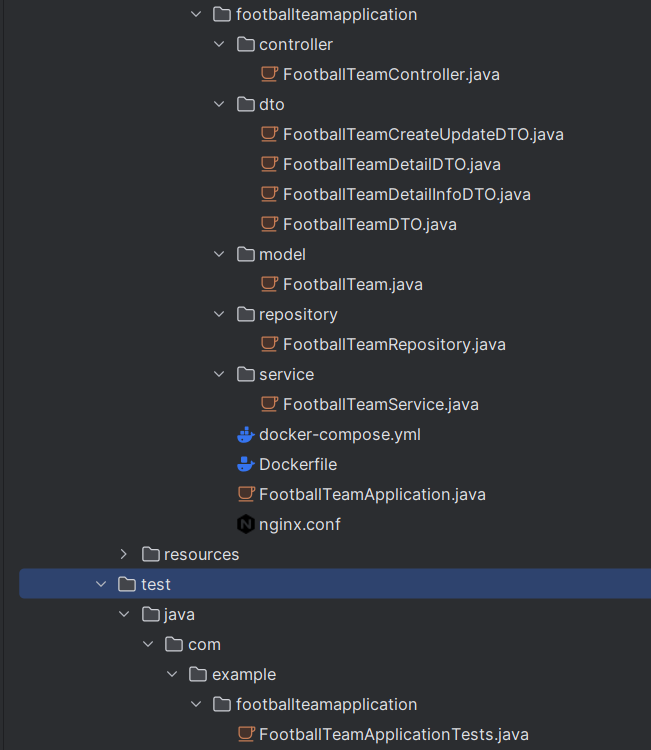
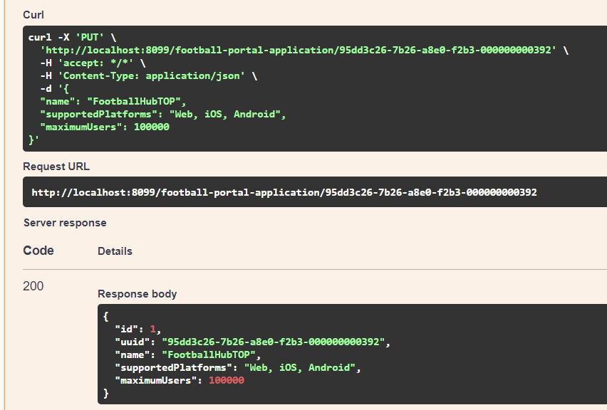

# Лабораторная работа №3 - REST API, Gateway и синхронный обмен между микросервисами

Цель: изучение шаблона проектирования gateway, построения синхронного обмена между микросервисами и архитектурного стиля RESTful API.

Задачи:

Создать 2 микросервиса, реализующих CRUD на связанных сущностях.
Реализовать механизм синхронного обмена сообщениями между микросервисами.
Реализовать шлюз на основе прозрачного прокси-сервера nginx.

# Создание микросервисов
1-й микросервис - football-portal-application для сущности Портал футбольной тематики
2-й микросервис - football-team-application для сущности Футбольная команда

Сущность: Футбольная команда (Football Team):

УИД (Уникальный идентификатор): Уникальный номер или код, идентифицирующий конкретную футбольную команду.
Название (Name): Название футбольной команды.
Год основания (Established Year): Год основания команды.
Дивизион (Division): Дивизион или лига, в которой участвует команда.
Тренер (Coach): Имя и фамилия тренера команды.
УИД портала (portalUuid): УИД портала футбольной тематики, с которым данная команда связана. Это поле устанавливает связь "1-ко-многим" между командой и порталом.
Информация о портале (portalInfo): Информация полученная по portalUuid и УИД портала о портале футбольной тематики. Хранит в себе информацию о Портале футбольной тематики (Name, Supported Platforms, Maximum Users).
Сущность: Портал футбольной тематики (Football Portal):

УИД (Уникальный идентификатор): Уникальный номер или код, идентифицирующий конкретный портал футбольной тематики.
Название (Name): Название портала футбольной тематики.
Поддерживаемые платформы (Supported Platforms): Операционные системы и устройства, на которых работает портал (Web, iOS, Android и др.).
Максимальное количество пользователей (Maximum Users): Максимальное количество пользователей, которые могут зарегистрироваться на портале.
Связь "1-ко-многим" между этими сущностями реализуется через поле "УИД портала" в сущности "Футбольная команда". Каждая команда связывается с конкретным порталом футбольной тематики через УИД этого портала, и это позволяет одному порталу быть связанным с несколькими футбольными командами.

Пример модели "Портал футбольной тематики" для списка:
{
    "uuid": "8f036445-a5bd-401c-926e-840f9de795cd",
    "Name": "FootballHub",
    "Supported Platforms": "Web, iOS, Android",
    "Maximum Users": 100000
}

Пример модели "Портал футбольной тематики" для создания или изменения:
{
    "uuid": "8f036445-a5bd-401c-926e-840f9de795cd",
    "Name": "FootballHub",
    "Supported Platforms": "Web, iOS, Android",
    "Maximum Users": 100000
}

Пример модели "Футбольная команда" для списка:
{
    "uuid": "8740d660-b251-4272-8535-be7ec3748d4b",
    "Name": "FC Red Stars",
    "Established Year": 1990,
    "Division": "Premier League",
    "Coach": "John Smith",
    "portalUuid": "8f036445-a5bd-401c-926e-840f9de795cd"
}

Пример модели "Футбольная команда" для создания или изменения:
{
    "Name": "FC Red Stars",
    "Established Year": 1990,
    "Division": "Premier League",
    "Coach": "John Smith",
    "portalUuid": "8f036445-a5bd-401c-926e-840f9de795cd"
}

Пример модели "Футбольная команда" для подробностей:
{
    "uuid": "8740d660-b251-4272-8535-be7ec3748d4b",
    "Name": "FC Red Stars",
    "Established Year": 1990,
    "Division": "Premier League",
    "Coach": "John Smith",
    "portalUuid": "8f036445-a5bd-401c-926e-840f9de795cd",
    "portalInfo": {
        "Name": "FootballHub",
        "Supported Platforms": "Web, iOS, Android",
        "Maximum Users": 100000
    }
}

    
1-й микросервис

    

    
2-й микросервис

    

- контроллеры для обработка запросов, дтошки для отображения в сваггере, модели для сущностей, репозитории для отправки данных, сервисы для бизнес-логики

# Докер файлы, докер компоус, nginx

    
Докер файл 1-го микросервиса

    

    
Докер файл 2-го микросервиса

    

-Использования базового образа, установка рабочий директории, копирования jar файла, экспорт порта, запуск приложения при запуске контейнера

    
Докер компоус

    

-создания общей сети для сервисов, запуск образов сервисов, проброска портов, копирования конфигурационного файла nginx и запуск этого сервиса после запуска других сервисов 

    
nginx

    

установка количества одновремменных подключений, прослушка запросов по 80 порту, серверное имя локалхост, адрес для переадресации запросов по нему, url переадрусации

    
Скрин созданых образов

    

    
Скрин созданых контейнеров

    

    
Swagger 1-го микросервиса

    

    

    

    

    

    
Swagger 2-го микросервиса

    

    

    

    

    

# Видео

Видео с разбором лабораторной работы - https://disk.yandex.ru/i/I3F_t9NhVJPtAg